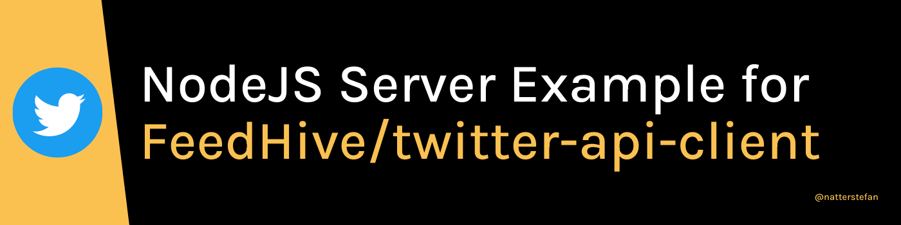

# twitter-api-client-server

[](https://github.com/natterstefan/twitter-api-client-server/issues)
[](https://github.com/natterstefan/twitter-api-client-server/stargazers)
[](https://github.com/natterstefan/twitter-api-client-server/blob/main/LICENSE)
[](https://github.com/natterstefan/twitter-api-client-server)



NodeJS server that uses [FeedHive/twitter-api-client](https://github.com/FeedHive/twitter-api-client)
to interact with the Twitter API.

## Table of content

- [Features](#features)
- [**Requirements**](#requirements)
- [**Getting Started**](#getting-started)
- [Docker](#docker)
- [Help](#help)
- [Contribute](#contribute)
- [License](#license)

---

## Features

- NodeJS server with watch mode support (thanks to [nodemon](https://www.npmjs.com/package/nodemon))
- Two example routes using the Twitter API client
- Full [Docker](https://www.docker.com/) support
- [ESLint](https://github.com/eslint/eslint) and [prettier](https://github.com/prettier/prettier)
  setup
- [Jest](https://www.npmjs.com/package/jest) & [supertest](https://www.npmjs.com/package/supertest) setup for tests
- **Fully typed!**
- with GitHub Action Continuous integration workflow

## Requirements

You need to apply for [Twitter's Developers programm](https://developer.twitter.com/en/apply-for-access)
and create an application. You will need to obtain the secrets and tokens to
interact with the API.

## Getting Started

```bash
# Step 1
# --> install dependencies
yarn

# Step 2
# --> prepare the .env file
yarn copyfiles

# Step 3
# --> open the .env-file and add the missing information

# Step 4
# --> build the app the first time
yarn build

# Step 5
# --> start the app
yarn start
```

### Example Links

- <http://localhost:3000/>: home route
- <http://localhost:3000/api/accountsAndUsers/usersSearch/natterstefan>: Provides a simple, relevance-based search interface to public user accounts on Twitter.
- <http://localhost:3000/api/tweets/statusesUserTimeline/natterstefan>: Returns a collection of the most recent Tweets posted by the user indicated by the screen_name

## Docker

This node application is dockerized and can be used in a docker environment.

### How to run the Docker Image

```bash
# this will first build and then start the docker image
docker-compose up --build
```

### How to build the Docker Image

```bash
docker-compose build
```

## Help

- Reach out on [Twitter](https://twitter.com/natterstefan)
- Open an [issue on GitHub](https://github.com/natterstefan/twitter-api-client-server/issues/new)

### Troubleshooting

- The app does not start? Make sure you run `yarn build` before the very first
  time you start the app.

## Contribute

### Issues

In the case of a bug report, bugfix or a suggestions, please feel very free to open an issue.

### Pull request

Pull requests are always welcome!

## Misc

- <https://github.com/microsoft/TypeScript-Node-Starter>
- <https://github.com/w3tecch/express-typescript-boilerplate>
- <https://github.com/gothinkster/node-express-realworld-example-app>

## Contributors ✨

Thanks goes to these wonderful people
([emoji key](https://allcontributors.org/docs/en/emoji-key)):

<!-- ALL-CONTRIBUTORS-LIST:START - Do not remove or modify this section -->
<!-- prettier-ignore-start -->
<!-- markdownlint-disable -->
<table>
  <tr>
    <td align="center"><a href="https://natterstefan.me/"><br /><sub><b>Stefan Natter</b></sub></a><br /><a href="#ideas-natterstefan" title="Ideas, Planning, & Feedback">🤔</a></td>
  </tr>
</table>

<!-- markdownlint-restore -->
<!-- prettier-ignore-end -->

<!-- ALL-CONTRIBUTORS-LIST:END -->

This project follows the
[all-contributors](https://github.com/all-contributors/all-contributors)
specification. Contributions of any kind welcome!

## Licence

[Apache 2.0](LICENSE)
